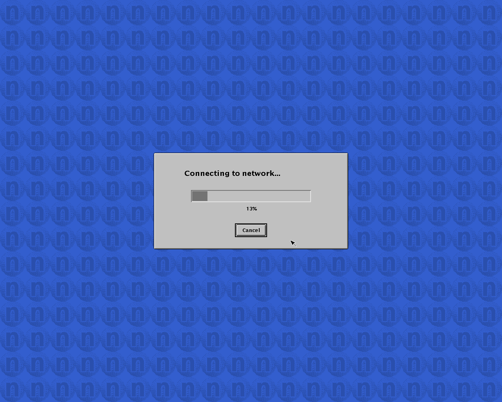
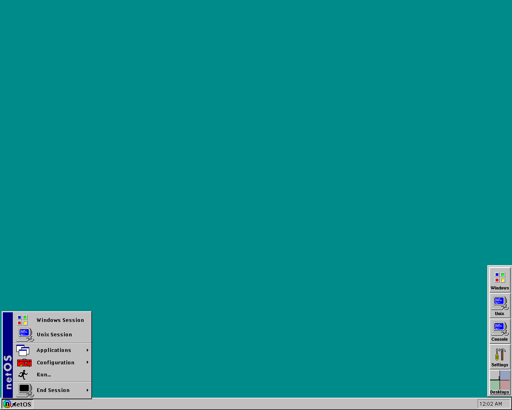
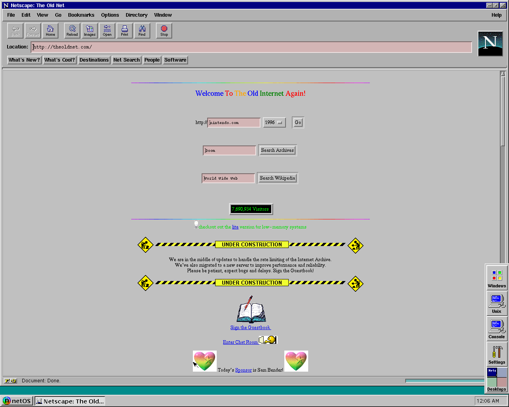

# HDS ViewStation FX / Neoware @workStation in MAME

A MAME driver for the HDS ViewStation FX, sold later by Neoware as the @workStation: an
Intel 80960CA network computer from the mid 90s, with a 256 colour screen of up to
1280x1024, a local IDE disk and **netOS**, HDS's own UNIX derived from 4.4BSD. It boots
netOS 3.2 (1997) from its local disk to the X desktop, and runs Netscape Navigator 3.0 on
the Internet through built-in user mode networking.

No HDS or Neoware software is included here. Everything the machine runs comes from the
netOS 3.2 CD, and the tools in this repository build the disk from it.

## What works

- The boot PROM: its blue splash screen, DHCP, loading netOS from the local disk.
- netOS 3.2 with its X server in 256 colours, the login dialog, the desktop, the menus,
  the console window and the bundled applications.
- Four monitors and screen sizes, as separate systems: `hdsfx` (1280x1024), `hdsfxv16`
  (1152x900), `hdsfxv14` (1024x768) and `hdsfxvesa` (800x600).
- Keyboard and PS/2 mouse.
- The Ethernet controller, with user mode networking (libslirp): netOS gets an address by
  DHCP and reaches the Internet with no host setup and no administrator rights.
- Netscape Navigator 3.0 for the i960, from the same CD, with its home on a writable
  4.2BSD partition that netOS mounts as `/disk1`. Only `http://` sites work;
  <http://theoldnet.com> serves the old web in a form it can show.

Not emulated: sound, PCMCIA, the serial ports (the DUART is there, nothing is connected),
the vertical retrace interrupt and the flash board.

## What it took

| part | how |
|---|---|
| Intel 80960CA | added to MAME's i960 core, which only had the 80960KB, plus five bug fixes: [docs/CPU.md](docs/CPU.md) |
| video | G300 and TLC34075 boards, VRAM block write, monitor switches: [docs/VIDEO.md](docs/VIDEO.md) |
| disk | a 4.4BSD label, the boot code, netOS's read-only devf file system and a writable /disk1: [docs/DISK.md](docs/DISK.md) |
| Ethernet | 82596 self-test, a libslirp network provider for MAME: [docs/NETWORK.md](docs/NETWORK.md) |
| the rest | memory map, interrupts, keyboard controller, boot PROM: [docs/HARDWARE.md](docs/HARDWARE.md) |

Two findings cost the most time. MAME's `addc` never produced a carry, which broke the
i960's software floating point and showed up as fonts with the top of every letter cut
off. And the VRAM block write covers 16 pixels per word, with the second half of a
32-pixel group reached three different ways by different code.

## Layout

    driver/     the MAME driver, one file (src/mame/hds/viewstation.cpp)
    patches/    changes to MAME: the i960 core, the 82596 self-test, the slirp network
                provider, the machine list, and an optional startup warnings fix
    tools/      disk builder, netOS overlay, LZRW3-A unpacker, i960 disassembler
    harness/    install, build, run headless, Netscape's first run, pack assembly
    pack/       launchers and README of the Windows pack
    docs/       what was worked out

## Building

The patches are against MAME 60e07cb1 (2026-09-23).

    MAME_SRC=/path/to/mame harness/install.sh
    MAME_SRC=/path/to/mame SLIRP_PREFIX=/usr harness/build.sh

`SLIRP_PREFIX` must hold libslirp's headers and library; on Debian and Ubuntu that is
`libslirp-dev`, which can also just be unpacked with `dpkg -x`. For Windows, see the top
of `harness/build-windows.sh` (MSYS2, with libslirp and glib linked statically, so the
executable needs no extra DLL).

## The disk

Get `NetOS.iso` from <https://archive.org/details/neoware_netos32> and extract it, then:

    NETOS_CD=/path/to/extracted/iso tools/mkdisk.sh netos.hd
    MAME_BIN=/path/to/netos ROMS=roms DISK=netos.hd harness/firstrun.sh

`roms/hdsfx/v32-bootprom.bin` is `netos32/netOS/image/i960/V32-bootprom.bin` from the
same CD. `firstrun.sh` is optional: it runs Netscape once so that its license is
accepted. Then run MAME with a window:

    netos hdsfx -rompath roms -hard netos.hd -window -nomaximize

Booting takes about two and a half minutes to the login dialog; press "Don't log in".
Netscape is under netOS menu, Applications, Internet, and takes one or two minutes to
open.

## Windows pack

    harness/mkpack.sh netos.exe netos.hd V32-bootprom.bin

makes a folder and a zip with the executable, the disk, the boot PROM, one launcher per
screen size and [pack/README.txt](pack/README.txt), which explains how to use and close
it.

## Where to look

- <https://virtuallyfun.com/2026/09/25/i960-unix-workstation-hds-neoware-workstation/>:
  the post that started this, about the machine and netOS.
- <https://archive.org/details/neoware_netos32>: the netOS 3.2 CD. Besides netOS for the
  i960 and the PowerPC, it has the HDSware 3.2.1 tree with Netscape, the user and system
  administrator manuals in HTML, and the boot PROM images.

## License

BSD-3-Clause, see [LICENSE](LICENSE), like MAME's own drivers. libslirp, which the
network provider uses, is BSD-3-Clause as well.
